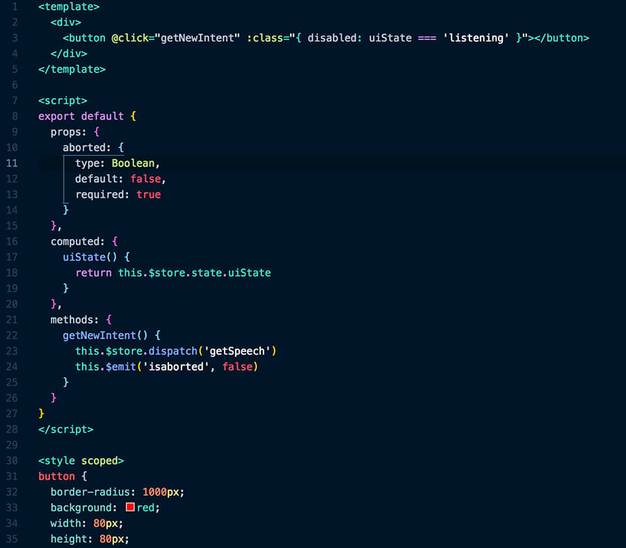

# Night Owl 🌌

> A VS Code theme for the night owls out there. Works well in the daytime, too, but this theme is specially tuned for those of us who like to code late into the night. Color choices have taken into consideration what is accessible to people with colorblindness.



# Installation

1.  Install [Visual Studio Code](https://code.visualstudio.com/)
2.  Launch Visual Studio Code
3.  Choose **Extensions** from menu
4.  Search for `night-owl-vscode-theme`
5.  Click **Install** to install it
6.  Click **Reload** to reload the Code
7.  File > Preferences > Color Theme > **Night Owl**

The font in the preview image is Dank Mono, [available here](https://dank.sh/). Editor settings to activate font ligatures:

```
"editor.fontFamily": "Dank Mono",
"editor.fontLigatures": true,
```
