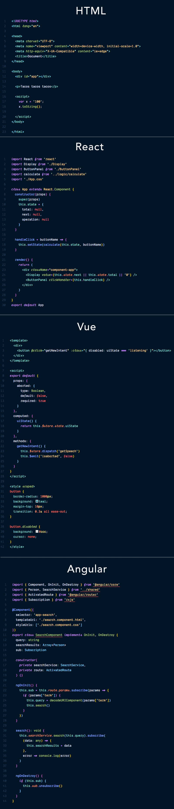

# Night Owl 🌌

A VS Code theme for the night owls out there. Works well in the daytime, too, but this theme is fine-tuned for those of us who like to code late into the night. Color choices have taken into consideration what is accessible to people with colorblindness and in low-light circumstances. Decisions were also based on meaningful contrast for reading comprehension and for optimal razzle dazzle. ✨



# Installation

1.  Install [Visual Studio Code](https://code.visualstudio.com/)
2.  Launch Visual Studio Code
3.  Choose **Extensions** from menu
4.  Search for `night-owl-vscode-theme`
5.  Click **Install** to install it
6.  Click **Reload** to reload the Code
7.  File > Preferences > Color Theme > **Night Owl**

The font in the preview image is Dank Mono, [available here](https://dank.sh/). Editor settings to activate font ligatures:

```
"editor.fontFamily": "Dank Mono",
"editor.fontLigatures": true,
```

The preview image is using [Bracket Pair Colorizer](https://marketplace.visualstudio.com/items?itemName=CoenraadS.bracket-pair-colorizer), a really cool extension that highlights matching brackets. This can help reduce unwanted errors.

I use this setting:

```
"bracketPairColorizer.forceIterationColorCycle": true,
```


This is my first foray into creating a theme, so if you see something amiss, please feel free to [file an issue](https://github.com/sdras/night-owl-vscode-theme/issues)! I'm sure there are things I missed.

This palette was inspired in part by Material Palenight [Theme](https://marketplace.visualstudio.com/items?itemName=whizkydee.material-palenight-theme), and the accessibility idea was inspired in part by Solarized [Themes](http://ethanschoonover.com/solarized)
